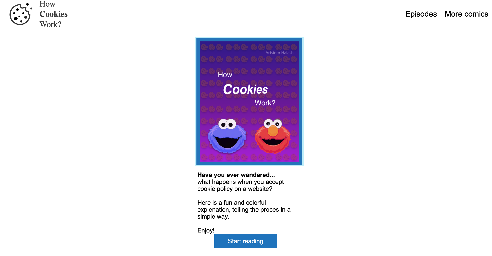

# How-cookies-work?
This project is meant to increase the awarness of technologies used daily by many people who may not know their meaning.
Have you ever wandered what "accept our cookie policy" means and what you give your consent to? Is the question a lot of people do not concider throughout web surf.
I decided to tell the meaning of cookies by illustrating a simple and colorful comic that would catch attention and not bore the reader with a lot of technicat detales. You can read the comic [here](https://s5216253.bucomputing.uk/webcomics/index.html) and maybe learn a few new things!

### Screenshot 
Screenshot of the index pag of the comic.

### Technologies 
* HTML 5, CSS 3
* Illustrations in *Illustrator, *Adobe XD

### Status 
There are a lot more ideas to be illustrated and explained in comics. Continue the story of cookies, Improve phone grid and layout.

### Inspiration 
Great thanks to guy from [dnsimple.com](https://howhttps.works) for their comics that imspired me to spread awarness in a creative way.
